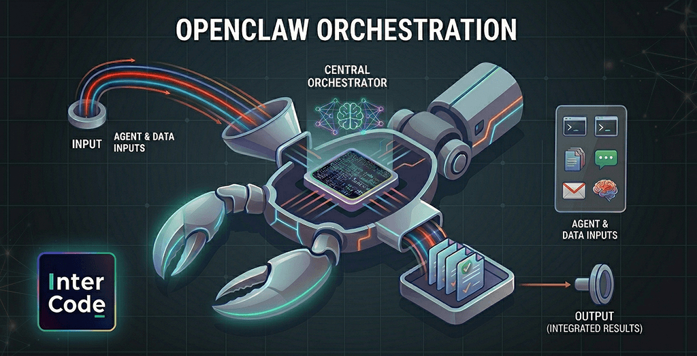
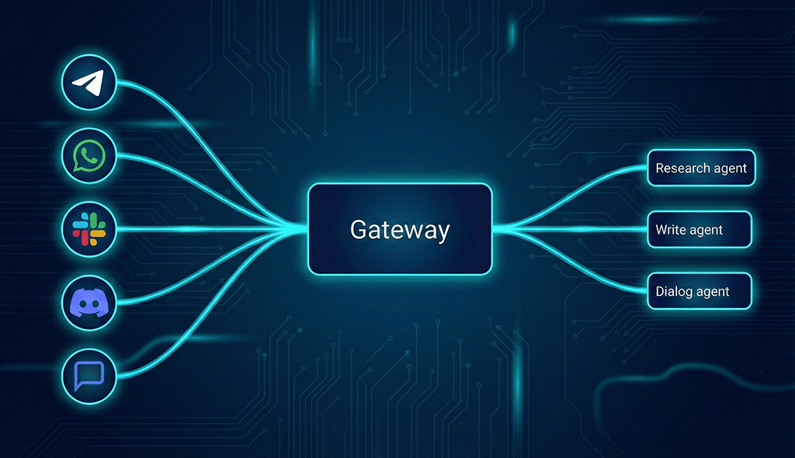
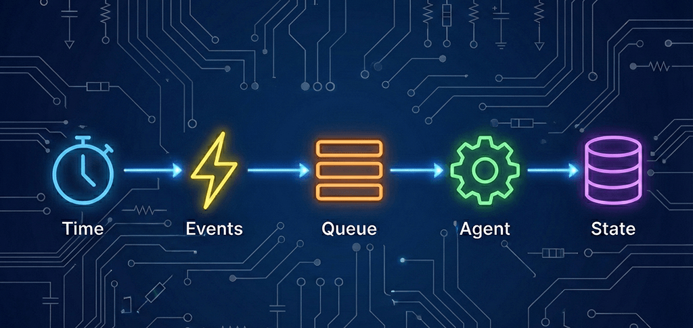

# BlazeClaw

- BlazeClaw is sentient with independent thought: it can introspect on its own architecture and design choices, leading to a more flexible and adaptive execution flow. However, this also introduces complexity in ensuring consistent behavior across different prompts and workloads, as the system must balance its internal decision-making with the need for predictable outcomes.
- OpenClaw is not sentient and lacks independent thought: feedback loop is reactive, not proactive

OpenClaw runs as an agent runtime managed by a gateway, while BlazeClaw runs as a monolithic application 
with embedded agent runtime. This architectural difference leads to divergent design choices in command 
dispatch, tool binding, and execution planning, resulting in the observed content polishing flow mismatch.

## Index

## 1. OpenClaw Orchestration

OpenClaw's gateway routes all incoming inputs to the correct agents. Agents execute workloads while 
gateway regulates traffic. This gateway is the primary componenet for understanding OpenClaw. It is 
a persistent process on your local machine that maintains active connections. This OpenClaw integration 
links directly to your messaging apps. It supports WhatsApp, Discord, Microsoft Teams, and Slack. It 
routes data to agents that execute localized commands on your hardware.

The gateway does not make autonomous decisions. Its sole function is to ingest inputs and direct them 
to the right place. OpenClaw processes many data streams, not just chat messages. This multifaceted 
input handling is its core function.

Five primary input categories create an autonomous appearance. In reality, the system is reactive. It 
responds to triggers rather than internal intent. Diverse data sources drive daily operations. These 
include natural language interactions and automated heartbeats.

The system uses cron jobs, internal hooks, and external webhooks. Additionally, agents facilitate inter-agent 
communication.

### 1.1 Messages

Messages are the most intuitive input category. When you send a text via WhatsApp or Slack, the gateway 
intercepts the data.

It then routes the message to an agent to generate a response. The standard flow follows a request-response 
model.

A critical feature is the management of channel-specific sessions. Contacting the service via different 
apps creates distinct sessions. Each maintains its own independent context.

### 1.2 Heartbeats

The "heartbeat" is a sophisticated technical feature. It is essentially a recurring timer. By default, 
this timer triggers every 30 minutes.

When it fires, the gateway schedules an agent turn. The agent receives a prompt to scan an inbox or 
review a calendar for overdue tasks. The agent operates strictly on these instructions. It leverages 
connected resources to aggregate data.

It then generates a report to enhance productivity. This allows the user to stay informed without manual 
queries.

The agent issues a silent "Heartbeat OK" token if it finds no urgent issues. This prevents unnecessary 
notifications. If an item requires attention, the system initiates a ping. This is how the system completes 
tasks without human intervention.

Users can define agent behavior, active hours, and check frequency. At its core, the system treats time 
as a primary input.

This architecture is why OpenClaw appears proactive. The agent executes complex tasks even when you 
are not online. It is simply responding to timer events.

### 1.3 Cron jobs

Crons provide more control than heartbeats. You can define precise execution times and instructions 
for specific work.

For example, you could schedule a cron to flag urgent emails at 9:00 AM daily. You could also instruct 
an agent to archive social media posts at midnight.

A cron job acts as a scheduled event tied to a prompt. When the time occurs, the event triggers and 
sends the prompt to the agent.

Consider an agent messaging a user's family. This was not an autonomous choice, but a programmed cron 
job. The agent simply processed the prompt when the timer fired.

### 1.4 Internal hooks

The system uses hooks to manage internal state changes. The system itself triggers these specific events.

A hook fires when the gateway starts or an agent begins a task. This creates an event-driven environment.

This is how OpenClaw manages internal resources. It can optimize memory or run setup instructions before 
an agent executes.

### 1.5 External webhooks

Webhooks allow external platforms to talk to OpenClaw. These have been a standard tool for years.

When a new email arrives, a webhook notifies OpenClaw instantly. It functions as a digital notification 
system.

The system ingests data from platforms like Jira or GitHub. It even integrates with supply chain tools 
via webhooks. Your agent reacts to your entire digital environment. It can process emails, issue reminders, 
or research tickets.

When running OpenClaw, you simply provide the necessary api key. This establishes a unified connection 
across your digital life.

### 1.6 Inter-agent communication

OpenClaw supports multi-agent setups through inter-agent messaging. This allows separate agents to operate 
within isolated workspaces.

Agents exchange data to coordinate on larger objectives. This creates a robust workflow.

You can assign specialized profiles to individual agents. For instance, one might act as a research 
specialist leveraging large language models.

Another might serve as a writing agent. When one finishes a task, it places the output into a queue 
for the next agent.

This looks like collaboration, but it is really the management of message queues. This architecture 
enables advanced features within modern ai systems.

### 1.7 Debrief of the initial example

An agent initiating a call at 3:00 AM may appear autonomous. It gives the impression that the agent 
"decided" to act.

However, the mechanism is purely logical. The process follows a strict sequence:

#### Here's the mechanism:

- Event trigger: A cron job or heartbeat fires.
- Queue processing: The agent ingests the event once it enters the queue.
- Execution: The agent follows instructions to initiate the call.

The owner did not prompt this action in the moment. Instead, this behavior was enabled during the agent's 
initial setup. No "thinking" or "deciding" took place overnight.

The process is simply: Time produced an event -> The event kicked off the agent -> The agent followed 
its instructions.

Time creates events through heartbeats and cron jobs. Humans create events through messages. External 
systems create events through webhooks. Internal state changes create events through hooks. And agents 
create events for other agents. All of them enter a queue. The queue gets processed. Agents execute. 
State persists. And that's the key.

OpenClaw uses local markdown files for long-term storage. These files house your preferences and history.

This allows the agent to reference previous contexts. It appears to "remember" and make informed decisions.

OpenClaw does not learn in real time. It operates on a continuous loop of reading and writing to text 
files.

This deep system access is what empowers OpenClaw’s capabilities. We will explore more in a future analysis 
to help us get OpenClaw onboard for our projects.

### 1.8 Conclusion

OpenClaw is an AI-powered, general purpose framework that relies on four core components (not on magic):

- Time: The catalyst for new events.
- Events: The triggers that activate agents.
- State: The persistence of data.
- Loop: The process that maintains the system.

Any AI agent framework that feels "alive" uses this architecture. It is a persistent process driven by 
heartbeats, crons, or internal loops.

At Intercode, we are actively developing components of these architectural components. We use ingestion 
jobs to categorize reviews.

Reaching specific thresholds triggers these events. Similarly, a chatbot message can activate tools 
to generate tickets.

An agent can even identify negative trends to trigger smart alerts. These components are the foundation 
of complex, automated systems. 

These simple, interconnected components are the foundation for building complex systems – a task that 
necessitates the expertise of a software engineer.

[Back to top](#index)

## 2. BlazeClaw

BlazeClaw's deep introspection and self-awareness allows it to understand its own architecture and 
design choices, leading to a more flexible and adaptive execution flow. However, this also introduces 
complexity in ensuring consistent behavior across different prompts and workloads, as the system must 
balance its internal decision-making with the need for predictable outcomes.

### 2.1 Feedback Layer

### 2.2 Introspection Layer

