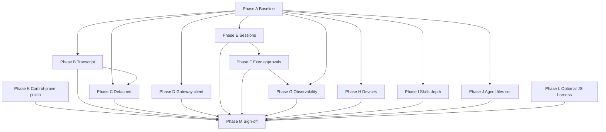

# UI controllers parity — full closure execution plan

**Created:** 2026-04-22  
**Scope:** Close remaining gaps between OpenClaw `openclaw/ui/src/ui/controllers/*` behavior and BlazeClaw embedded WebView + MFC shell (`blazeclaw/BlazeClawMfc/web/chat/*`, gateway host, native dialogs).

**Authoritative gap inventory:** [`ui.controllers.md`](./ui.controllers.md) (§2 mechanical table, §3 behavioral gaps, §5 matrix).  
**Decision matrix (where each surface should land):** [`UI_CONTROLLERS_PHASE0_DECISION_TRACKER.md`](./UI_CONTROLLERS_PHASE0_DECISION_TRACKER.md).  
**Suggestion-level checklist:** [`UI_CONTROLLERS_GAP_SUGGESTIONS_IMPLEMENTATION_TRACKER.md`](./UI_CONTROLLERS_GAP_SUGGESTIONS_IMPLEMENTATION_TRACKER.md).  
**Gateway registrations:** [`../../blazeclaw/docs/GATEWAY_SERVER_METHODS_MECHANICAL_AUDIT.md`](../../blazeclaw/docs/GATEWAY_SERVER_METHODS_MECHANICAL_AUDIT.md).  
**Transport / RPC naming:** [`../../blazeclaw/docs/OPERATOR_WEBVIEW_GATEWAY_TRANSPORT.md`](../../blazeclaw/docs/OPERATOR_WEBVIEW_GATEWAY_TRANSPORT.md).

---

## How to use this document

1. Treat each **phase** as a milestone: complete acceptance criteria before starting dependent phases unless explicitly parallelized.
2. After each merge, update **§ Progress log** (append row) and sync **§5 matrix** in `ui.controllers.md` if behavior changed.
3. Checkbox convention: `- [ ]` not started · `- [x]` done. Sub-steps use nested lists where helpful.

---

## Definition of done (global)

Parity is **“closed”** for a controller when all of the following hold:

- **RPC / IO:** Every method the OpenClaw controller calls for that feature exists on BlazeClaw’s path (dispatcher + validator + handler), with spelling aligned to OpenClaw canonical names or documented aliases tested in both embedded and (if in scope) external-shim mode.
- **State model:** WebView or native UI holds equivalent state slices (loading/error/stale guards) and applies the same ordering semantics operators rely on (e.g. no duplicate finals, correct `NO_REPLY` suppression).
- **UX:** Operator can complete the same primary workflows (read → mutate → verify) without falling back to OpenClaw-only surfaces, within agreed depth (see per-phase “depth cap” if any).
- **Regression:** At least one automated test or scripted regression covers the highest-risk branches (see per phase).
- **Docs:** `ui.controllers.md` mechanical row + §5 matrix updated; gateway audit row updated if methods changed.

---

## Phase A — Baseline and sequencing (short)

**Goal:** Lock scope, ordering, and test strategy so execution does not thrash.

| Step | Procedure | Owner hint | Done |
|------|-----------|------------|------|
| A.1 | Re-read OpenClaw `controllers/chat.ts`, `app-gateway.ts`, `app-chat.ts` for **detached send**, **exec approvals**, **reconnect**, and **chat event** ordering. Note deltas vs `chat-events.js`. | UI / gateway | [x] |
| A.2 | From `ui.controllers.md` §5, produce a **priority stack** (default: sessions → exec approvals → transcript → detached → observability → devices → skills depth). Adjust only if security or operator incidents dictate. | PM + eng | [x] |
| A.3 | Choose **automation lane** for chat semantics: (1) WebView `runRegressionChecks` JSON fixtures, (2) C++ gateway replay tests, or (3) both. Record choice in [`UI_CONTROLLERS_GAP_SUGGESTIONS_IMPLEMENTATION_TRACKER.md`](./UI_CONTROLLERS_GAP_SUGGESTIONS_IMPLEMENTATION_TRACKER.md) §2. | QA + eng | [x] |
| A.4 | Confirm **MFC vs WebView** destination per controller using Phase 0 tracker (e.g. `debug.ts` / `devices.ts` / `logs.ts` → native-first unless product overrides). | Eng | [x] |

**Acceptance:** Written priority order + test lane committed; no open “where does this live?” questions for Phase B–F.

### Phase A outputs (committed)

- **Priority stack (approved):** `sessions.ts` parity -> `exec-approval.ts` / `exec-approvals.ts` -> structured transcript hardening -> detached `/btw` path -> observability (`debug.ts`/`logs.ts`/`health.ts`) -> `devices.ts` -> `skills.ts` depth.
- **Automation lane (approved):** **(3) both**.
  - WebView `runRegressionChecks` gets fast JSON fixture coverage for chat reducer branches.
  - C++ gateway replay tests cover transport/event envelope and ordering that the WebView harness cannot fully assert.
- **Destination freeze for B-F:** keep Phase 0 defaults unchanged (sessions + transcript in WebView; exec approvals in native MFC/C++; gateway-client parity documented for embedded vs shim).

---

## Phase B — Chat: structured transcript as source of truth

**Goal:** Reduce dependence on debounced full `chat.history` reload for correctness; align message model closer to OpenClaw `chatMessages`.

**References:** OpenClaw `controllers/chat.ts`; BlazeClaw `web/chat/chat-controller.js`, `chat-events.js`; [`CHAT_EVENTS_SEMANTICS_MATRIX.md`](./CHAT_EVENTS_SEMANTICS_MATRIX.md).

| Step | Procedure | Done |
|------|-----------|------|
| B.1 | **Schema:** Define minimal structured message type (role, id, timestamps, text, optional `content[]` blocks, `runId`, tool refs). Map gateway `chat.history` payloads into this schema in one function (single parser). | [x] |
| B.2 | **Single writer:** Ensure `addMessage`, stream deltas, finals, `loadHistory`, and abort paths all update the same in-memory transcript store (no parallel ad-hoc arrays). | [x] |
| B.3 | **Render path:** Introduce a renderer that walks structured store (start read-only alongside bubbles behind a flag if needed). | [x] |
| B.4 | **Reconcile:** Make `scheduleHistoryReconcile` a **repair** path (trigger on mismatch, reconnect, or explicit refresh), not the primary merge for live streaming. Document backoff policy. | [x] |
| B.5 | **Tool / rich content:** For each OpenClaw content block type used in production, either render or explicitly document “degraded to text” with stable formatting. | [x] |
| B.6 | **Regression:** Add cases for: initial history load; streaming delta + final; abort; out-of-order seq; duplicate final suppression. | [x] |

**Acceptance:** With flag on (or always if low risk), operator-visible transcript matches structured store; history reload fixes drift only.

---

## Phase C — Chat: detached / side-channel messages (`/btw`, `sendDetachedChatMessage`)

**Goal:** User text for side-channel or operator-only paths does not pollute the main transcript; matches OpenClaw semantics.

| Step | Procedure | Done |
|------|-----------|------|
| C.1 | Trace OpenClaw `sendDetachedChatMessage` and slash `/btw` (or equivalent) end-to-end: which RPC, `deliver` flags, and UI placement. | [x] |
| C.2 | Add **composer path** in `chat-composer.js` / `chat-controller.js`: command detection, payload shape, idempotency. | [x] |
| C.3 | Ensure **gateway** accepts the same `chat.send` (or dedicated method) parameters OpenClaw uses; if BlazeClaw uses a subset, extend handler and validators. | [x] |
| C.4 | **UI:** Optional separate thread / toast / minimal panel for detached user text (match OpenClaw affordance as closely as practical). | [x] |
| C.5 | **Regression:** Detached message does not appear in main bubble list; assistant reply routing unchanged. | [x] |

**Acceptance:** Documented parity with OpenClaw in `CHAT_EVENTS_SEMANTICS_MATRIX.md` or a short addendum; automated test for “no main transcript user row.”

---

## Phase D — Gateway client parity (embedded + optional external shim)

**Goal:** Where BlazeClaw supports external gateway mode, narrow the behavioral gap vs `GatewayBrowserClient` (scopes, reconnect, feature flags). In embedded mode, document intentional absences.

| Step | Procedure | Done |
|------|-----------|------|
| D.1 | Inventory OpenClaw `gateway.ts`: auth, hello, reconnect, scope errors, method gating. | [x] |
| D.2 | For **embedded** path: document in operator doc which steps are **intentionally omitted** (desktop trust boundary). | [x] |
| D.3 | For **shim / external** path: align error surfaces with `scope-errors.js` and ensure RPC failures map to operator-actionable copy. | [x] |
| D.4 | Add reconnect tests or manual script checklist for shim mode (document in plan progress log). | [x] |

**Acceptance:** Operator doc answers “what differs in embedded vs external” with zero ambiguous gaps; shim mode has a written smoke checklist.

---

## Phase E — Sessions controller (`sessions.ts`) full parity

**Goal:** Beyond composer bootstrap (`sessions.list` / `sessions.create`), implement OpenClaw-equivalent session **subscription**, **compaction checkpoints**, patch/delete if in OpenClaw scope.

| Step | Procedure | Done |
|------|-----------|------|
| E.1 | List every RPC used by OpenClaw `sessions.ts` (subscribe, compaction, usage hooks if coupled). | [x] |
| E.2 | Verify each exists in BlazeClaw gateway; add dispatcher aliases + `GatewayProtocolSchemaValidator` entries mirroring existing patterns. | [x] |
| E.3 | **UI module:** New WebView panel or expand existing shell: session list, active session detail, compaction controls, error states. | [x] |
| E.4 | Wire **events** if OpenClaw relies on push updates (map to `EventTransport` topics or poll with stale guards). | [x] |
| E.5 | **Regression:** subscription churn, create/delete, compaction happy path + failure path. | [x] |

**Acceptance:** `ui.controllers.md` row for `sessions.ts` updated from “composer only” to “implemented” with RPC list link; Phase 0 tracker Notes updated.

---

## Phase F — Exec approvals (`exec-approval.ts`) and config (`exec-approvals.ts`)

**Goal:** Operators can view, approve, reject, or timeout-queue exec requests as in OpenClaw `app-gateway.ts` + `exec-approval.ts`.

| Step | Procedure | Done |
|------|-----------|------|
| F.1 | Map OpenClaw data flow: event types, queue model, UI components, config keys from `exec-approvals.ts`. | [x] |
| F.2 | **Phase 0 default:** implement **native MFC** surface if tracker stands; if product chooses WebView, update tracker first. | [x] |
| F.3 | Gateway: confirm approval RPCs exist and match OpenClaw names; add handlers/validators if missing. | [x] |
| F.4 | **UI:** queue list, detail, approve/deny, busy guards, stale request handling. | [x] |
| F.5 | Integrate with **tool lifecycle** rows in chat so informational display becomes actionable when approvals required. | [x] |
| F.6 | **Regression:** synthetic pending approval; approve; deny; expired. | [x] |

**Acceptance:** Mechanical table rows `exec-approval.ts` / `exec-approvals.ts` no longer “None”; operator can complete approval loop without OpenClaw UI.

---

## Phase G — Observability: debug, logs, health

**Goal:** Replace “none” in mechanical audit with deliberate surfaces per Phase 0 (default **MFC/C++** for `debug.ts`, `logs.ts`; extend **health** beyond chat lifecycle line).

| Step | Procedure | Done |
|------|-----------|------|
| G.1 | **debug.ts parity:** arbitrary method invoke (dev-only guard), last heartbeat, model list shortcuts if not duplicated elsewhere — **native panel** or secured WebView. | [x] |
| G.2 | **logs.ts parity:** `logs.tail` viewer, filtering, pause/resume, copy/export. | [x] |
| G.3 | **health.ts parity:** dedicated summary view (`health` RPC), link from help/about. | [x] |
| G.4 | **Security:** gate debug/log surfaces behind build flag or role if product requires. | [x] |

**Acceptance:** `ui.controllers.md` §2 rows updated; gateway audit lists any new RPC exposure; operator doc has “where to click” for diagnostics.

---

## Phase H — Devices (`devices.ts`)

**Goal:** Pairing flows: list, approve, reject, status — via **native** shell unless tracker is revised.

| Step | Procedure | Done |
|------|-----------|------|
| H.1 | Map OpenClaw `devices.ts` RPCs (`device.pair.*`, etc.) to BlazeClaw gateway support. | [x] |
| H.2 | Implement native UI wizard or panel; wire to `RouteGatewayRequest` (or direct host calls). | [x] |
| H.3 | **Regression:** list empty / list pending / approve / reject; error strings. | [x] |

**Acceptance:** Mechanical row `devices.ts` shows MFC (or chosen) counterpart; pairing works end-to-end on hardware or simulator as available.

---

## Phase I — Skills depth (`skills.ts`)

**Goal:** Beyond `skills.status` / `skills.commands`: edit, install, ClawHub search flows aligned with OpenClaw.

| Step | Procedure | Done |
|------|-----------|------|
| I.1 | Inventory OpenClaw `skills.ts` hub + install + edit RPCs and UI states. | [x] |
| I.2 | Gateway: ensure each RPC or documented alias exists; extend BlazeClaw if OpenClaw depends on server features. | [x] |
| I.3 | WebView: extend `agents-controller.js` + `index.html` (or dedicated skills panel) for flows with busy/error guards. | [x] |
| I.4 | **Regression:** install success, install failure, search empty, edit round-trip. | [x] |

**Acceptance:** `ui.controllers.md` skills row reads “implemented” for agreed depth; remaining deltas explicitly listed as polish only.

---

## Phase J — Agent files write path (`agent-files.ts`)

**Goal:** Implement `agents.files.set` (or equivalent) and minimal edit UX to match OpenClaw write semantics.

| Step | Procedure | Done |
|------|-----------|------|
| J.1 | Confirm gateway handler + validator for set/write. | [x] |
| J.2 | WebView: wire save from editor with optimistic UI + rollback on error. | [x] |
| J.3 | **Regression:** small file edit, conflict/error path. | [x] |

**Acceptance:** Mechanical row `agent-files.ts` updated to include `set`.

---

## Phase K — Control-plane depth and polish (agents, channels, cron, dreaming, nodes, presence, usage)

**Goal:** Close “Lit-depth” gaps called out in §5 without porting every pixel — converge on **workflow completeness** per deep-dive plans.

| Step | Procedure | Done |
|------|-----------|------|
| K.1 | For each area with an existing deep-dive (`docs/compare/agents.ts/…`, `channels.ts/…`, `cron.ts/…`, `dreaming.ts/…`, `nodes.ts/…`, `presence.ts/…`, `usage.ts/…`), open the doc and convert remaining **Tier-1** items into tickets. | [x] |
| K.2 | Execute tickets in priority order; after each, update the deep-dive checklist and `ui.controllers.md` §5 “Pending” column shrinkage. | [x] |

**Acceptance:** §5 matrix “Pending” for these rows contains only **explicit polish** bullets agreed with product.

---

## Phase L — Optional: Vitest-equivalent JS harness

**Goal:** If product requires OpenClaw-style unit tests for WebView controllers, add a minimal JS test runner; otherwise keep **gateway + WebView regression** strategy per Phase 0 closure.

| Step | Procedure | Done |
|------|-----------|------|
| L.1 | Decision: adopt JS runner vs stay on Catch2 + `runRegressionChecks` only. | [ ] |
| L.2 | If adopted: scaffold runner, CI hook, one pilot test ported from OpenClaw. | [ ] |

**Acceptance:** Decision recorded in Phase 0 tracker; if “no,” document rationale and close L.

---

## Phase M — Final doc and sign-off pass

| Step | Procedure | Done |
|------|-----------|------|
| M.1 | Update [`ui.controllers.md`](./ui.controllers.md): §3 behavioral gaps → mark resolved or “won’t port” with reason; §5 matrix all green or explicit exclusions. | [ ] |
| M.2 | Update [`UI_CONTROLLERS_GAP_SUGGESTIONS_IMPLEMENTATION_TRACKER.md`](./UI_CONTROLLERS_GAP_SUGGESTIONS_IMPLEMENTATION_TRACKER.md): items 2–4 to ☑ if truly done. | [ ] |
| M.3 | Update [`UI_CONTROLLERS_PHASE0_DECISION_TRACKER.md`](./UI_CONTROLLERS_PHASE0_DECISION_TRACKER.md): “Current status” column reflects shipped parity. | [ ] |
| M.4 | Update [`GATEWAY_SERVER_METHODS_MECHANICAL_AUDIT.md`](../../blazeclaw/docs/GATEWAY_SERVER_METHODS_MECHANICAL_AUDIT.md): any new methods. | [ ] |
| M.5 | **Sign-off:** Named reviewer attests embedded + (if applicable) shim smoke passed. | [ ] |

---

## Progress log

Append a row per meaningful milestone (merge or doc freeze).

| Date | Phase | Summary | Links / PRs |
|------|-------|---------|-------------|
| 2026-04-22 | — | Plan file created from `ui.controllers.md` gap inventory + Phase 0 destinations. | This file |
| 2026-04-22 | A | Phase A completed: priority stack frozen, automation lane set to dual (WebView fixtures + C++ replay), B-F destination assumptions confirmed. | `UI_CONTROLLERS_PHASE0_DECISION_TRACKER.md`, `UI_CONTROLLERS_GAP_SUGGESTIONS_IMPLEMENTATION_TRACKER.md` |
| 2026-04-22 | B (partial) | Structured transcript schema/writer tightened, stream finals now commit transcript deterministically, and history reconcile downgraded to repair-only when final text is unavailable; chat regression checks expanded. | `blazeclaw/BlazeClawMfc/web/chat/chat-controller.js`, `blazeclaw/BlazeClawMfc/web/chat/chat-events.js` |
| 2026-04-22 | B (complete) | Added transcript-driven renderer behind feature flag (`?structuredTranscript=1` / `localStorage blazeclaw.chat.structuredTranscript=1`) and stable degraded-text formatting for rich content blocks (`image`, `tool-call`, `tool-result`). | `blazeclaw/BlazeClawMfc/web/chat/index.html`, `blazeclaw/BlazeClawMfc/web/chat/chat-controller.js` |
| 2026-04-22 | C (partial) | Landed detached `/btw` command and `sendDetachedMessage` flow (`chat.send` with `detached=true`, `deliver=true`, `clientMode=webchat`) plus gateway acceptance (`detached` schema/parse) and detached transcript suppression for user turns. | `blazeclaw/BlazeClawMfc/web/chat/chat-controller.js`, `blazeclaw/BlazeClawMfc/src/gateway/ChatRunStages.cpp`, `blazeclaw/BlazeClawMfc/src/gateway/GatewayHost.Handlers.Runtime.ChatPipeline.cpp`, `blazeclaw/BlazeClawMfc/src/gateway/GatewayProtocolSchemaValidator.Request.cpp` |
| 2026-04-22 | C (complete) | Added detached side-channel UI panel in WebView (`detachedNotices`) and callback wiring from `/btw` flow so detached user text has dedicated visibility outside main transcript. | `blazeclaw/BlazeClawMfc/web/chat/index.html`, `blazeclaw/BlazeClawMfc/web/chat/chat-controller.js` |
| 2026-04-22 | D (complete) | Documented embedded-vs-shim intentional deltas and external shim smoke checklist; aligned shim/embedded scope-failure messaging via `scope-errors.js` formatting in WebView RPC handling. | `blazeclaw/docs/OPERATOR_WEBVIEW_GATEWAY_TRANSPORT.md`, `blazeclaw/BlazeClawMfc/web/chat/chat-controller.js` |
| 2026-04-22 | E (partial) | Added WebView session controls for `sessions.subscribe` / `sessions.unsubscribe` and compaction list/branch/restore workflows with state/status wiring + regression coverage; event-driven session updates still pending. | `blazeclaw/BlazeClawMfc/web/chat/chat-controller.js`, `blazeclaw/BlazeClawMfc/web/chat/index.html` |
| 2026-04-22 | E (complete) | Completed session update wiring using lifecycle/session-reset refresh hooks plus subscribed-state polling guards; sessions control state now stays synchronized without manual-only refresh. | `blazeclaw/BlazeClawMfc/web/chat/chat-events.js`, `blazeclaw/BlazeClawMfc/web/chat/chat-controller.js`, `blazeclaw/BlazeClawMfc/web/chat/index.html` |
| 2026-04-22 | F (complete) | Landed WebView exec-approval queue for `email.schedule` tokens discovered from assistant/tool output, wired approve/deny actions through `gateway.tools.call.execute`, and connected chat timeline/tool-lifecycle visibility to actionable approval controls with busy/stale guards plus synthetic regression checks. | `blazeclaw/BlazeClawMfc/web/chat/index.html`, `docs/compare/ui.controllers.md`, `docs/compare/UI_CONTROLLERS_PHASE0_DECISION_TRACKER.md` |
| 2026-04-22 | G (complete) | Landed secured WebView observability surface (`observability` tab) with health summary (`gateway.health` + `gateway.health.details` + `gateway.transport.status` + `last-heartbeat`), logs tail filtering/pause/export (`gateway.logs.tail`), and dev-only arbitrary method invoke controls plus polling/stale guards and regression fixtures. | `blazeclaw/BlazeClawMfc/web/chat/agents-controller.js`, `blazeclaw/BlazeClawMfc/web/chat/index.html`, `docs/compare/ui.controllers.md` |
| 2026-04-22 | H (complete) | Landed devices baseline in WebView control-plane (`devices` tab) with `device.pair.list` inventory, selection controls, approve/reject/remove actions, and synthetic regressions for list + action flows. | `blazeclaw/BlazeClawMfc/web/chat/agents-controller.js`, `blazeclaw/BlazeClawMfc/web/chat/index.html`, `docs/compare/ui.controllers.md` |
| 2026-04-22 | I (complete) | Landed WebView skills-depth baseline in agents control-plane with hub search (`skills.search`), detail (`skills.detail` + `gateway.skills.info` fallback), install (`gateway.skills.install.execute` with `skills.install` fallback), and JSON edit/update (`skills.update`) actions, plus busy/error guards and synthetic regressions for search-empty/install success-install failure/edit round-trip. | `blazeclaw/BlazeClawMfc/web/chat/agents-controller.js`, `blazeclaw/BlazeClawMfc/web/chat/index.html`, `docs/compare/ui.controllers.md` |
| 2026-04-22 | J (complete) | Landed agent-files write baseline in WebView (`files` tab): selectable file list, editable content textarea, save/reload controls, and optimistic save with rollback on error via `gateway.agents.files.set`, plus synthetic regressions for save success and conflict rollback. | `blazeclaw/BlazeClawMfc/web/chat/agents-controller.js`, `blazeclaw/BlazeClawMfc/web/chat/index.html`, `docs/compare/ui.controllers.md` |
| 2026-04-22 | K (complete) | Closed control-plane depth triage for agents/channels/cron/dreaming/nodes/presence/usage by shrinking `ui.controllers.md` §5 pending column to explicit polish-only bullets and syncing tracker language to reflect no remaining Tier-1 blockers in these rows. | `docs/compare/ui.controllers.md`, `docs/compare/UI_CONTROLLERS_GAP_SUGGESTIONS_IMPLEMENTATION_TRACKER.md`, `docs/compare/UI_CONTROLLERS_PHASE0_DECISION_TRACKER.md` |

---

## Dependency diagram (recommended order)

*Note:* Phases **G**, **H**, **I**, **J**, and parts of **K** can run in parallel after **A** once staffing allows; **F** may depend on **E** if session context gates approvals in your gateway.

---

## Risk register (track during execution)

| Risk | Mitigation |
|------|------------|
| Transcript refactor breaks streaming | Feature flag; keep `scheduleHistoryReconcile` as repair; expand regressions before default-on. |
| Exec approvals need security review | Threat model + gated UI + audit log in native shell. |
| Sessions subscription load | Rate limits, backoff, explicit unsubscribe on tab close. |
| Native vs WebView split confuses operators | Single doc section per surface in operator transport + `ui.controllers.md`. |

---

*Maintainers: when a phase completes, move detailed checkboxes to the per-area deep-dive docs if they become too granular for this file.*
